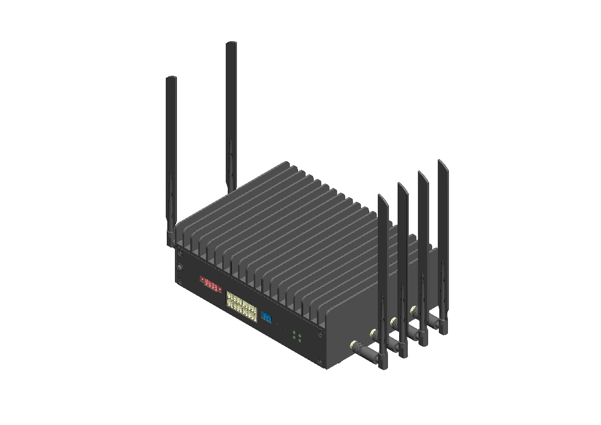
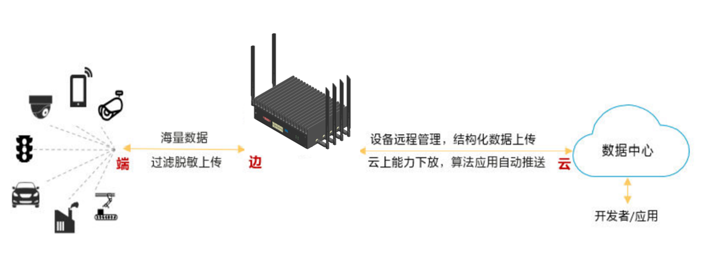

产品概述
========

边缘计算主机HS100（简称HS100）为面向广泛边缘应用场景的轻量边缘设备，具有超强计算性能、大容量存储、配置灵活、体积小、支持温度范围宽、环境适应性强、易于维护管理等特点。HS100主要应用于智能视频监控、分析、数据存储等应用场景，可以广泛部署在各类边缘、中心机房，满足在社区、园区、超市等复杂环境区域的应用。

HS100应用场景众多，包括智慧城市、智慧安防、智慧交通、智能制造、智慧零售等。

HS100典型应用场景采用“云-边-端”的架构。

* 端：IPC或其他端侧设备，进行现场信息采集；
* 边：边缘侧设备对端侧设备采集的信息进行信息提取、存储和上传；
* 云：云端数据中心对边侧设备进行模型推送、能力开发和管理、运维等。